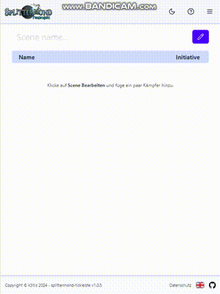

# Splittermond Tickleiste

Small responsive web app to manage the tickbar (Tickleiste) for Splittermond.

Try it out on [tickleiste.tklic.de](https://tickleiste.tklic.de), it's hosted via Github Pages.

**Features**

- **Create a scene** with any number of combatants
- Supports **special combat states** like _Waiting, Expecting, and Incapitated_
- Supports **conditions**, **condition levels** and **user defined conditions** like `panicked`, `burning II` or `glowing`
- **Choose a color** for each of the combatants
- **Save and load** the scene to and from your local device
- **No server** involved, **no login** necessary, scene data will be saved to the browsers **local storage**
- Optimized for **mobile** and **keyboard only control**
- Click the question mark button in the header to get a tour through the main features

## Assets

- Icons
  - https://lucide.dev
  - https://www.svgrepo.com

## Development

Install dependencies with `bun install`, then start the server with `bun run dev`.
To check for linting errors use `bun run lint` or automatically fix them using `bun run format`.
To check for a11y features the [firefox axe extension](https://addons.mozilla.org/en-US/firefox/addon/axe-devtools/) is recommended.

## Release

Except for the version bump, releasing is automated.

1. Bump version in `package.json`
2. Run the [Build and Deploy](https://github.com/k3ltis/splittermond-tickleiste/actions/workflows/deployment.yml) workflow for branch `main`.
