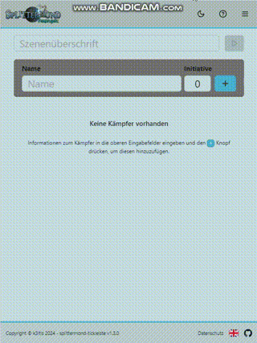

# Splittermond Tickleiste



Small responsive web app to manage the tickbar (Tickleiste) for Splittermond.

Try it out on [tickleiste.tklic.de](tickleiste.tklic.de), it's hosted via Github Pages.

**Features**

- Create a scene with any number of combatants
- Save and load the scene to and from your local device
- Supports special combat states like _Waiting, Expecting, and Incapitated_
- No server involved, no login necessary, scene data will be saved to the browsers local storage


## Assets

- Icons
  - https://lucide.dev
  - https://www.svgrepo.com

## Development

Start the dev server

```bash
bun run dev
```

## Deployment

Manual deployment to Github Pages

```bash
bun run build && bun run deploy
```

